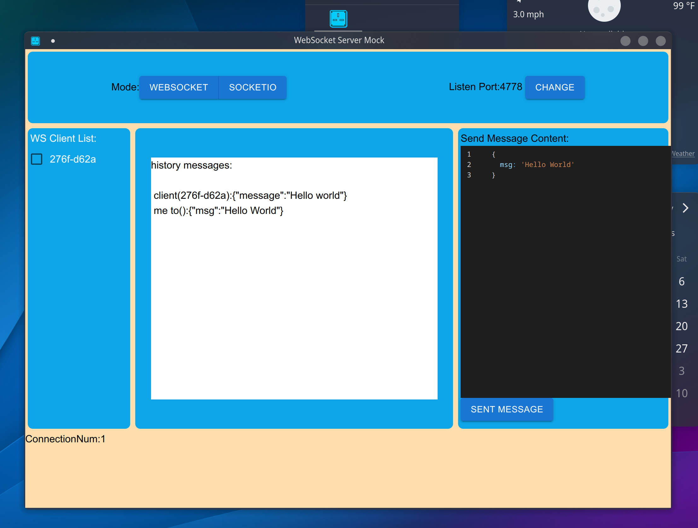

# What is it
WebSocketMock is a GUI program, aiming to imitate a websocket/socket.io Server quickly.

Although I just to code it now, But I believe it will be a powerful tool soon. 

# To do: 
-[ ] connect multiple websocket\socket.io Client and send message to any one or all.

-[ ] Script Tool, can code quickly a simple and powerful script to response difference socket requests.

# ScreenShot

Although the applicant is simple and ugly, But I will make it good at later.

# Installation
linux,mac,windows: https://github.com/CorrectRoadH/WebSocketMock/releases

# Usage
ws://localhost:4778

